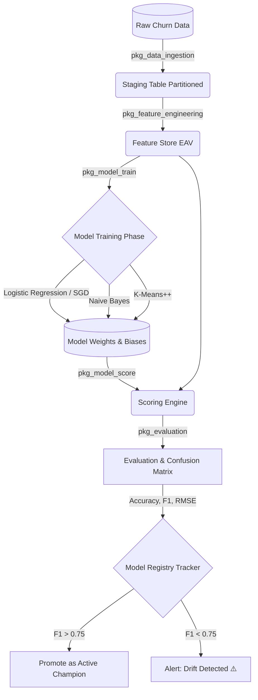

<div align="center">

# 🧠 Native PL/SQL Machine Learning Pipeline: Customer Churn Prediction
**Zero-Latency, Fully Autonomous ML Orchestration Inside Oracle Database**

[](https://www.oracle.com/database/)
[](#)
[](#)
[](#)

*An elite, production-ready framework that proves complex ML algorithms (Logistic Regression, Naive Bayes, K-Means Clustering) can be built from scratch and executed entirely within an Oracle RDBMS.*

</div>

---

## 📖 Table of Contents
- [Why In-Database ML?](#-why-in-database-ml)
- [System Architecture](#-system-architecture)
- [Key Features](#-key-features)
- [Implemented Algorithms](#-implemented-algorithms-from-scratch)
- [Project Structure & Pipeline Execution Flow](#-project-structure--pipeline-execution-flow)
- [Database Schema & Data Model](#-database-schema--data-model)
- [Installation Setup](#-installation--setup)
- [Monitoring & Evaluation Dashboard](#-monitoring--evaluation-dashboard)
- [Author & Contributions](#-author--contributions)

---

## 🎯 Why In-Database ML?

Traditional Machine Learning pipelines suffer from the **Data Gravity** problem: extracting millions of rows from a database over a network to a Python/Spark server is slow, insecure, and expensive. 

**This project flips the paradigm.** By bringing the algorithms *to the data*, we achieve:
1. **Zero Data Movement:** No network latency. No ETL pipelines. Data never leaves the database.
2. **Absolute Data Security:** Operates under standard Oracle RDBMS roles and grants. 
3. **Real-time Inference:** Score customers the second their data is updated.
4. **Leverage Infrastructure:** Built to exploit Oracle's parallel execution and in-memory caches natively.

---

## 🏛 System Architecture

The pipeline is modeled as an autonomous closed loop. It handles ingestion, feature transformation, training, scoring, evaluation, and registry promotion autonomously.



---

## 🚀 Key Features

* **100% Native PL/SQL Codebase:** No Java, Python, or external libraries. Pure procedural SQL.
* **EAV Feature Store:** A dynamic Entity-Attribute-Value feature store enabling scale without schema changes.
* **Automated MLOps Registry:** Handles model versioning (`ACTIVE`, `TRAINED`, `ARCHIVED`), with built-in zero-downtime rollbacks (`rollback_model`).
* **Automated Model Drift Alerts:** Utilizes `UTL_MAIL` to fire alerts to data scientists if model performance degrades below a baseline threshold.
* **Mathematical Underpinnings:** Heavy utilization of native mathematical functions (Sigmoid activation via `EXP`, Log-loss functions, and dot products) optimized using `BULK COLLECT` and `FORALL`.

---

## 📐 Implemented Algorithms (From Scratch)

This repository includes custom matrix-math implementations of the following algorithms:

1. **Logistic Regression:**
   - **Optimization:** Full Batch Gradient Descent.
   - **Activation:** Sigmoid function with limit clamping to prevent numerical overflow.
   - **Loss Function:** Binary Cross-Entropy (Log Loss).
2. **Gaussian Naive Bayes:**
   - Applies Bayes' theorem with strong independence assumptions.
   - Calculates feature means and standard deviations dynamically for Gaussian PDF.
3. **K-Means Clustering:**
   - **Initialization:** Industry-standard **K-Means++** seeding to prevent poor local optima.
   - **Distance:** Euclidean distance calculation.
   - **Convergence:** Iterative assignment and centroid recalculation loops.

---

## 📂 Project Structure & Pipeline Execution Flow

The logic is modularized across 8 purpose-built files. **They must be compiled in numerical order.**

| Order | File Name | Purpose | Key Concept |
|:---:|:---|:---|:---|
| `00` | `tables.sql` | Schema Definitions | Range Partitioning, Foreign Keys, Indexes |
| `01` | `pk_1_data_ingestion.sql` | `pkg_data_ingestion` | Null-rejection, Defaulting, `MERGE` statements |
| `02` | `pk_2_feature_engineering.sql` | `pkg_feature_engineering` | Analytical Functions, Z-Score/Min-Max Normalize |
| `03` | `pk_3_model_train.sql` | `pkg_model_train` | Gradient Descent, Mathematical Optimizations |
| `04` | `pk_4_model_score.sql` | `pkg_model_score` | Sigmoid Dot-Product, `BULK COLLECT` limits |
| `05` | `pk_5_model_registry.sql` | `pkg_model_registry` | MLOps Versioning, Promotions, Rollbacks |
| `06` | `pk_6_model_evaluation.sql` | `pkg_evaluation` | Confusion Matrix, RMSE, Precision, Recall |
| `07` | `full_pipeline.sql` | Master Orchestration | `DBMS_SCHEDULER`, Alerting, Analytical Views |

---

## 🗄 Database Schema & Data Model

The pipeline utilizes 7 primary tables designed for high-throughput OLTP operations:

*   **`staging_churn`**: The primary ingest point. Range-partitioned by `LOAD_DATE` for efficient historical archiving and partition swapping.
*   **`feature_store`**: A highly indexed EAV (Entity-Attribute-Value) table (`entity_id`, `feature_name`, `feature_value`) storing normalized features (e.g., `TENURE_ZSCORE`, `CHARGES_MINMAX`, `ARPU`).
*   **`model_registry`**: Tracks algorithm type, JSON hyper-parameters, status, and creation timestamps.
*   **`model_weights`**: Stores the learned constants natively (Weights, Biases, standard deviations for Bayes, or centroids for K-Means).
*   **`prediction_output`**: Stores the scored probability and predicted class label for fast downstream analytics.
*   **`training_log`**: Exhaustive epoch-by-epoch diagnostics including F1, Precision, and computation duration.
*   **`pipeline_audit`**: Built using `PRAGMA AUTONOMOUS_TRANSACTION` to ensure logging persists even when outer transactions `ROLLBACK`.

---

## 🛠 Installation & Setup

### Prerequisites
* **Oracle Database** (Version 11gR2, 12c, 19c, 21c, or 23ai).
* Pluggable Database (PDB) user with schema administration rights (`CREATE TABLE`, `CREATE PROCEDURE`, `CREATE JOB`, `CREATE VIEW`).
* *(Optional)* Network ACLs configured and `UTL_MAIL` installed for Model Drift email alerting.

### 1-Click Deployment (Sequential)
Using SQL*Plus, SQL Developer, or any IDE (DBeaver/DataGrip), run the scripts in sequence:

```sql
-- 1. Create the Schema layer
@tables.sql

-- 2. Compile Packages logic
@pk_1_data_ingestion.sql
@pk_2_feature_engineering.sql
@pk_3_model_train.sql
@pk_4_model_score.sql
@pk_5_model_registry.sql
@pk_6_model_evaluation.sql

-- 3. Initialize scheduling and reporting views
@full_pipeline.sql
```

### Manual Pipeline Trigger
To execute an immediate run spanning the whole pipeline (Ingest → Build Features → Train Logistic Regression → Score Output → Evaluate F1 → Auto-promote if F1 > 0.75), simply run:

```sql
BEGIN
    run_full_pipeline;
END;
/
```
*Note: A `DBMS_SCHEDULER` job named `CHURN_PIPELINE_DAILY` is automatically configured to run this daily at 02:00 AM.*

---

## 📊 Monitoring & Evaluation Dashboard

A real-time analytics view, `v_pipeline_dashboard`, is provided to monitor ML performance live!

```sql
SELECT 
    model_id AS "ID", 
    algorithm AS "Alg", 
    status, 
    accuracy_pct AS "Acc %", 
    f1_pct AS "F1 %",
    final_loss AS "Loss", 
    training_sec AS "Compute (s)"
FROM v_pipeline_dashboard 
WHERE ROWNUM <= 5;
```

---
<div align="center">
  <i>"Don't move the data to the algorithm, move the algorithm to the data."</i>
</div>
